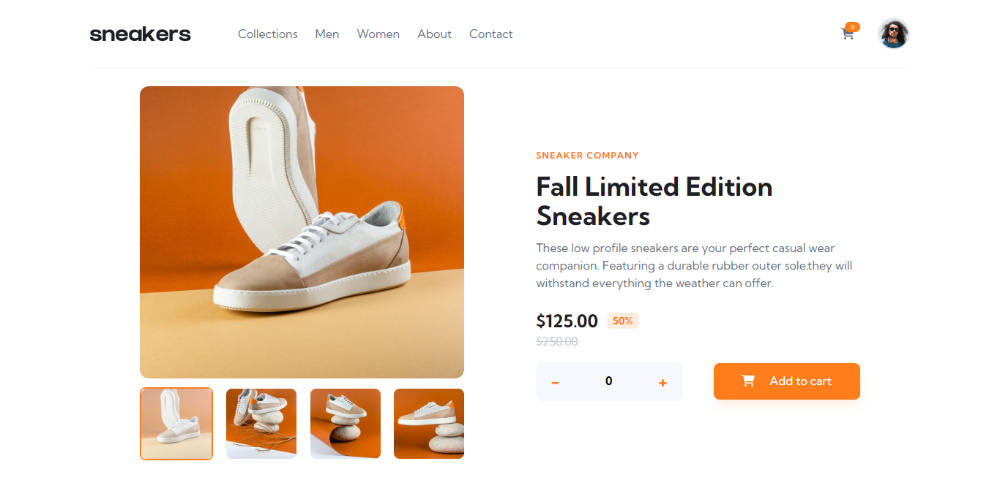

# Frontend Mentor - E-commerce product page solution

This is a solution to the [E-commerce product page challenge on Frontend Mentor](https://www.frontendmentor.io/challenges/ecommerce-product-page-UPsZ9MJp6). Frontend Mentor challenges help you improve your coding skills by building realistic projects.

## Overview

### The challenge

Users should be able to:

- View the optimal layout for the site depending on their device's screen size
- See hover states for all interactive elements on the page
- Open a lightbox gallery by clicking on the large product image
- Switch the large product image by clicking on the small thumbnail images
- Add items to the cart
- View the cart and remove items from it

### Screenshot

### Links

- Solution URL: [ecommerce netlify](https://main-ecommerce.netlify.app)
- Live Site URL: [ecommerce github](https://github.com/nick335/singlePageProductSiteTypesript)

### Built with
- Semantic HTML5 markup
- Tailwind CSS
- React
- Typescript

## Author

- Website - [Nicholas](https://nicholaserigo.netlify.app/)
- Frontend Mentor - [@nick335](https://www.frontendmentor.io/profile/nick335)

